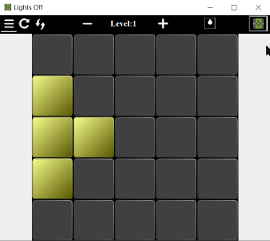
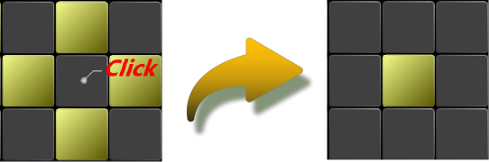

LightsOff
----------

**Lights Off** is a casual puzzle game.
You need to turn off **all** the lights of **n** rows and **m** columns in order to gain success.
When you turn on/off a light, the lights **around** will also turn as a consequence.
 

 

Launch
----------
the encoding of all files is UTF-8.
- JRE:11.0.5 
- JRE:1.8.0 

[GenerateSeeds](./code/GenerateSeeds)
----------
In this catalogue are the files that generate the particular numbers in [Tip.java](./code/src/LightsOff/Tip.java) 

Round-button
----------
in [Block.java](./code/src/LightsOff/Block.java)

